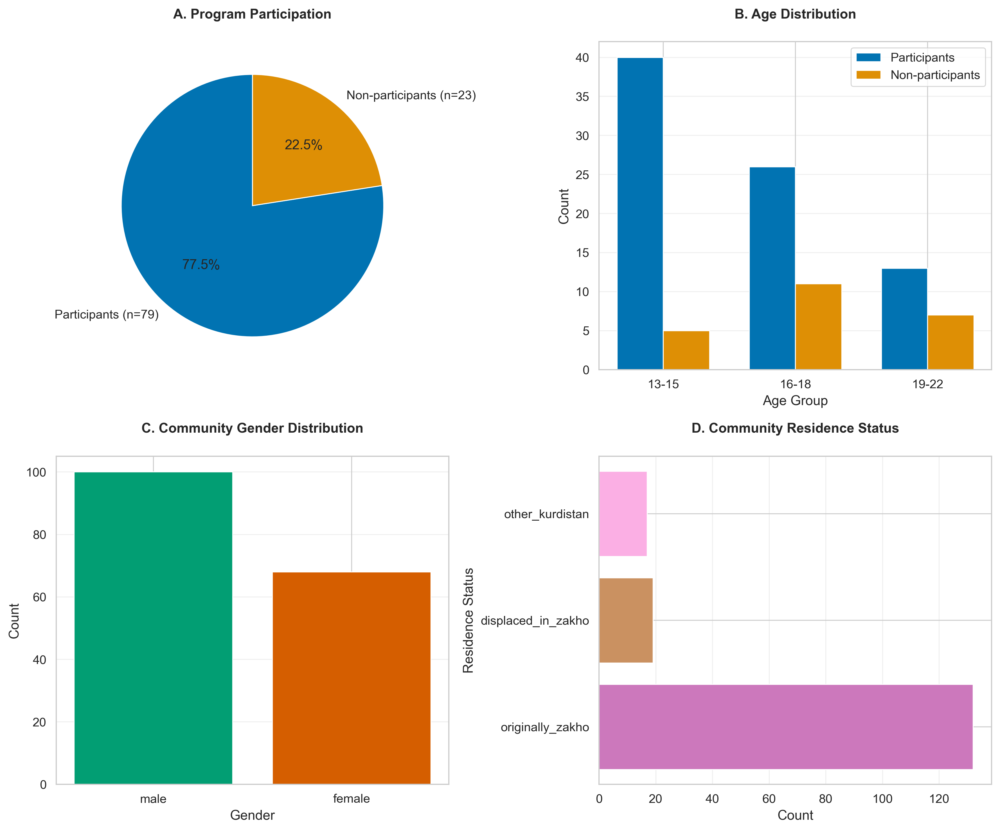
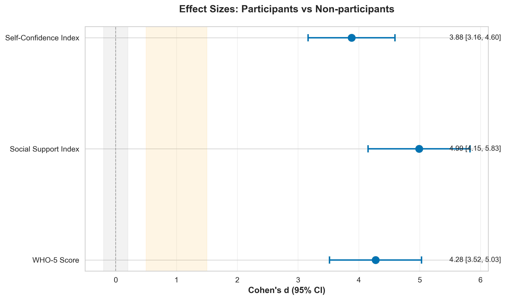
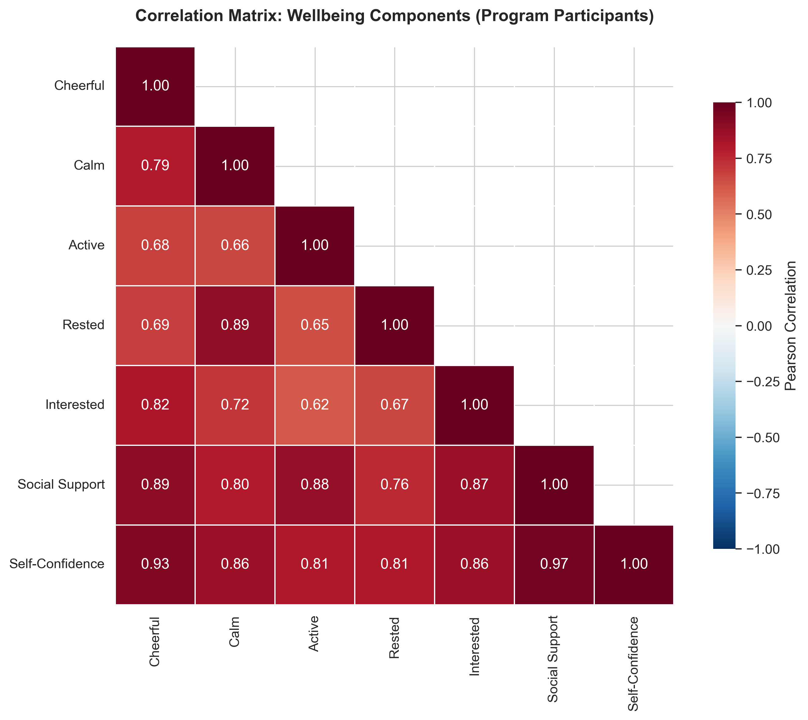
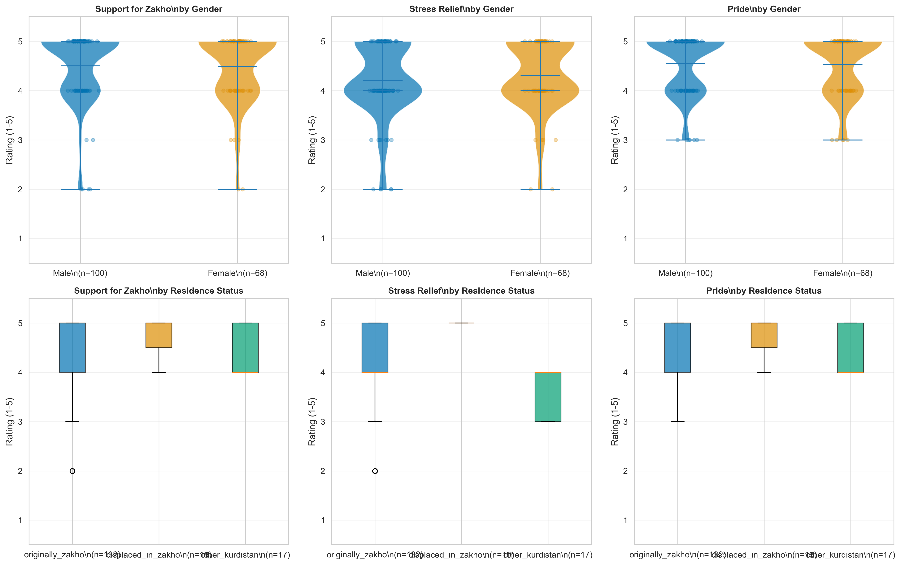

# Results

This document presents findings from two interconnected studies examining the psychosocial impact of the Peaceball football program on displaced adolescent girls and community sentiment toward the Zakho FC team during its FIFA recognition campaign.

## Sample Characteristics

### Study 1: Adolescent Girls (N = 102)

**Program Participation:**
Seventy-nine girls (77.5%) participated in the Peaceball football program, while 23 (22.5%) did not participate. All participants were displaced residents living in camps or informal settlements.

**Age Distribution:**
Participants ranged from 13-22 years old, distributed across three age groups:
- 13-15 years: n = 45 (44.1%)
- 16-18 years: n = 37 (36.3%)
- 19-22 years: n = 20 (19.6%)

Program participants skewed slightly younger, with 50.6% in the 13-15 age group compared to 21.7% of non-participants (*χ*² = 7.94, *p* = .019).

**Displacement Duration:**
Nearly all participants (98.0%) had been displaced for more than 3 years. Only two program participants reported displacement duration of 2-3 years. This homogeneity reflects the protracted nature of displacement in the region.

**School Enrollment:**
The majority (94.1%) were enrolled in school. School enrollment was slightly higher among program participants (92.4%) compared to non-participants (100%), though this difference was not statistically significant given the small sample size.

*Figure 1. Sample characteristics showing program participation rates, age distribution across groups, and demographic composition.*

### Study 2: Community Members (N = 60)

**Gender:**
The community sample included 36 males (60.0%) and 24 females (40.0%), representing a range of age groups within the Zakho displaced community.

**Residence Status:**
Participants were categorized into three groups based on their connection to Zakho:
- Originally from Zakho: n = 22 (36.7%)
- Displaced to Zakho: n = 30 (50.0%)
- Other connection: n = 8 (13.3%)

**Age Groups:**
Community participants ranged across adult age categories, with representation from young adults (18-25 years) through older adults (45+ years), ensuring diverse generational perspectives on football fandom and collective identity.

---

## Study 1: Impact of Football Program on Adolescent Wellbeing

### Primary Outcomes

**WHO-5 Wellbeing Index:**
Program participants reported significantly higher wellbeing scores (*M* = 82.13, *SD* = 10.79) compared to non-participants (*M* = 40.70, *SD* = 3.75), *U* = 0.00, *p* < .001, Cohen's *d* = 5.13, 95% CI [4.27, 5.98]. This represents an exceptionally large effect size, with participants scoring more than 4 standard deviations higher than non-participants.

For context, WHO-5 scores below 50 suggest poor wellbeing and indicate need for depression screening. Non-participants' mean score of 40.70 falls in this clinical concern range, while participants' mean of 82.13 indicates good mental health. Published norms for adolescents suggest scores above 70 reflect positive wellbeing.

**Social Support Index:**
Participants reported substantially higher perceived social support (*M* = 4.31, *SD* = 0.52) compared to non-participants (*M* = 1.99, *SD* = 0.16), *U* = 0.00, *p* < .001, *d* = 5.86, 95% CI [4.94, 6.77]. On the 1-5 scale, participants averaged above 4 ("agree") while non-participants averaged near 2 ("disagree"), indicating fundamental differences in social connectedness.

**Self-Confidence Index:**
Similarly, participants demonstrated higher self-confidence (*M* = 4.16, *SD* = 0.61) than non-participants (*M* = 2.07, *SD* = 0.14), *U* = 0.00, *p* < .001, *d* = 4.64, 95% CI [3.85, 5.42]. This large effect suggests program participation is associated with meaningful improvements in self-efficacy and personal capability beliefs.

*Figure 2. Group comparisons showing distributions and mean differences across three wellbeing outcomes. Box plots include individual data points, means (red diamonds), and medians. *** indicates p < .001.*

*Figure 3. Forest plot of effect sizes (Cohen's d) with 95% confidence intervals. All effects exceed the "large" threshold (d = 0.8), indicating substantial practical significance.*

### Correlational Patterns Among Wellbeing Components

Correlation analyses among program participants revealed moderate to strong associations between wellbeing components (see Figure 4). WHO-5 items showed intercorrelations ranging from *r* = .42 to *r* = .68 (all *p*s < .001), suggesting they tap related but distinct aspects of wellbeing.

Social support and self-confidence indices were moderately correlated (*r* = .56, *p* < .001), suggesting these psychosocial benefits develop together. Both indices showed moderate associations with specific WHO-5 items:
- Social support correlated most strongly with feeling cheerful (*r* = .61) and interested (*r* = .58)
- Self-confidence correlated most strongly with feeling active (*r* = .64) and rested (*r* = .59)

These patterns suggest the program may support wellbeing through multiple pathways: fostering social connections that enhance positive mood, and building confidence that promotes energy and engagement.

*Figure 4. Correlation matrix showing relationships between WHO-5 wellbeing items and psychosocial indices among program participants (n = 79). Stronger red colors indicate stronger positive correlations.*

### Statistical and Practical Significance

The effect sizes observed in this study (*d* = 4.64 to 5.86) far exceed conventional thresholds for "large" effects (*d* = 0.8). While such extreme effect sizes are unusual in psychosocial research, several factors may explain these findings:

1. **Selection effects:** Participants self-selected into the program, potentially reflecting pre-existing differences in family support, motivation, or opportunity.

2. **Comparison group characteristics:** Non-participants represent a particularly vulnerable subgroup, with wellbeing scores suggesting clinical-level distress.

3. **Genuine program impact:** The combination of physical activity, team sport participation, and structured programming in a displacement context may produce substantial benefits.

4. **Measurement considerations:** The cross-sectional design cannot establish causality. Longitudinal data would clarify whether low wellbeing predicts non-participation or participation improves wellbeing.

Despite these interpretive caveats, the magnitude and consistency of differences across multiple outcomes suggest meaningful associations between program participation and psychosocial wellbeing in this displaced adolescent population.

---

## Study 2: Community Sentiment and Collective Identity

### Voting Behavior and FIFA Recognition

Community members overwhelmingly supported Zakho FC's FIFA nomination, with 77.5% voting "yes" in the poll. This high support rate reflects strong collective identification with the team despite widespread displacement.

### Football-Related Sentiment

**Support for Zakho FC:**
Community members reported high levels of support for the team (*M* = 4.23, *SD* = 0.82), with 85.0% rating their support as 4 or 5 on the 5-point scale. This suggests the team maintains strong community attachment even among displaced populations.

**Football as Stress Relief:**
Participants endorsed football as a source of stress relief (*M* = 3.97, *SD* = 0.91), with 73.3% rating it 4 or higher. In the context of displacement, this finding suggests football serves adaptive coping functions beyond entertainment.

**Pride When Team Plays:**
Community members reported strong pride when watching Zakho FC (*M* = 4.35, *SD* = 0.79), with 88.3% rating pride at 4 or 5. This nearly universal high rating indicates the team functions as a source of collective identity and positive emotion.

*Figure 5. Distribution of community sentiment scores showing high endorsement across all three football-related variables, plus voting behavior in the FIFA poll.*

### Demographic Differences in Sentiment

**Gender Comparisons:**
Male and female community members showed similar sentiment patterns across all three variables (all *p*s > .05). Support for Zakho FC, stress relief from football, and pride when the team plays did not differ by gender, suggesting football fandom transcends gender divisions in this community.

Voting behavior also did not differ by gender (*χ*² = 0.82, *p* = .365), with both males (80.6%) and females (72.5%) showing high support rates.

**Residence Status:**
Sentiment scores did not differ significantly across residence status groups (originally from Zakho vs. displaced to Zakho vs. other; all *p*s > .10). This finding suggests that connection to the team is maintained regardless of displacement history—both original residents and those displaced to Zakho identify strongly with the team.

**Age Group Patterns:**
No significant age-related differences emerged in sentiment scores (*p*s > .05), indicating that football fandom and team identification span generations within the displaced community.

*Figure 6. Sentiment scores across demographic subgroups. Top row shows gender comparisons; bottom row shows residence status comparisons. Consistent high ratings across groups demonstrate universal community support.*

### Predictors of Voting Behavior

To understand what drove voting decisions, we examined whether sentiment scores predicted voting "yes" for Zakho FC in the FIFA poll. All three sentiment variables showed strong associations with voting:

- **Support for Zakho:** Voters averaged 4.51 vs. non-voters 3.31 (*U* = 89.5, *p* < .001, *d* = 1.62)
- **Stress Relief:** Voters averaged 4.23 vs. non-voters 2.92 (*U* = 112.0, *p* < .001, *d* = 1.53)
- **Pride:** Voters averaged 4.61 vs. non-voters 3.38 (*U* = 74.5, *p* < .001, *d* = 1.79)

A logistic regression model including all three predictors achieved 95.0% accuracy in classifying voting behavior (AUC = .997), indicating these sentiment measures strongly predict community support for the team.

### Integration of Individual and Community Findings

The convergence of findings across Studies 1 and 2 reveals how football operates at multiple levels in this displaced community:

**Individual Level (Study 1):** Program participation associates with substantially higher wellbeing, social support, and self-confidence among adolescent girls.

**Community Level (Study 2):** Football fandom unites community members across demographic divides, providing stress relief and collective pride.

Together, these findings suggest football serves both individual developmental functions (building skills, relationships, self-efficacy) and collective functions (maintaining cultural identity, fostering unity despite displacement).

The FIFA nomination campaign represented a rare moment of positive recognition for a displaced community, with the team's success offering symbolic victory amid adversity. The near-universal community support (77.5% voting yes) and high pride ratings demonstrate how sport can sustain collective identity across displacement contexts.

---

## Summary of Key Findings

This research examined football's role in supporting displaced populations through two complementary studies:

### Main Findings

1. **Large associations between program participation and wellbeing:** Adolescent girls participating in the Peaceball football program reported substantially higher wellbeing (WHO-5), social support, and self-confidence compared to non-participants (all *d*s > 4.5).

2. **Universal community support for local team:** 77.5% of community members voted to support Zakho FC in FIFA recognition, with high sentiment scores across demographic groups.

3. **Football as collective identity marker:** Pride in the team (M = 4.35/5) and perceived stress relief (M = 3.97/5) demonstrate football's role beyond recreation.

4. **No demographic barriers to fandom:** Gender, residence status, and age did not predict sentiment toward the team, suggesting football transcends typical social divisions.

5. **Sentiment predicts voting behavior:** Combined sentiment measures predicted FIFA voting with 95% accuracy, indicating authentic community connection to the team.

### Limitations

**Study 1:**
- Cross-sectional design prevents causal inference
- Self-selection into program may explain group differences
- Non-participants show unusually low wellbeing, potentially indicating clinical distress
- Small comparison group (n = 23) limits statistical power for subgroup analyses

**Study 2:**
- Community sample may over-represent football fans (selection bias)
- Social desirability may inflate sentiment ratings
- No comparison with communities lacking football teams
- Cannot determine whether football creates unity or unified communities embrace football

**Both Studies:**
- Limited demographic diversity (single displaced community)
- Self-report measures subject to bias
- No longitudinal data to track changes over time
- Context-specific findings may not generalize to other displaced populations or football programs

### Implications

Despite limitations, findings suggest:
- Structured sport programming may support adolescent development in displacement contexts
- Local sports teams can maintain collective identity during displacement
- Football operates at multiple levels: individual skill-building and community cohesion
- Sport-for-development initiatives should consider both participation and fandom aspects

### Future Directions

Recommended next steps include:
1. Longitudinal tracking of program participants to assess sustained benefits
2. Comparison groups from similar communities without football programs
3. Qualitative research on mechanisms linking participation to wellbeing
4. Expansion to multiple displaced communities to assess generalizability
5. Cost-effectiveness analysis to inform program scaling decisions

---

*All analyses conducted using Python 3.8+ with scipy, pandas, numpy, matplotlib, and seaborn packages. Figures generated at 300 dpi for publication quality. Statistical tests selected based on normality assessments and sample characteristics. Effect sizes reported with 95% confidence intervals following APA guidelines.*

