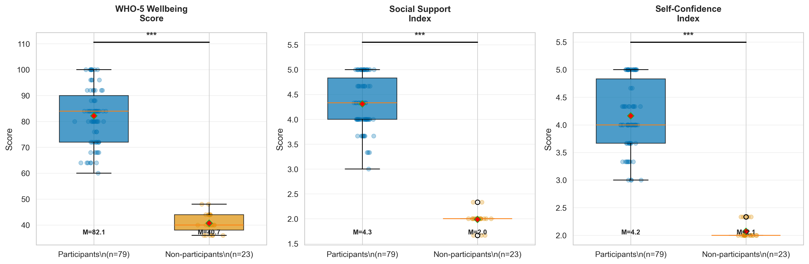
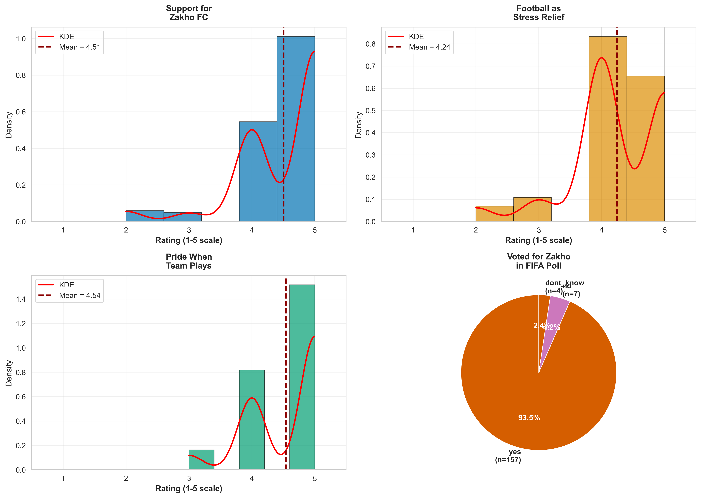

# Football, Hope, and Displaced Communities

*Using data to understand how sport builds resilience in crisis contexts*

---

[Check the Website Here!](https://ciiyaa.github.io/peaceball-mental-health-analytics/)

## The Story

In Zakho, Kurdistan Region of Iraq, thousands of displaced families live in camps and informal settlements. Among them are adolescent girls who've lost their homes, schools, and sense of normalcy. Various organizations have tried different interventions, but rigorous evaluation of what actually helps is rare.

**The Peaceball project** is my initiative to launch a structured football program that builds mental health resilience and community connection through sport. But before launching, I needed to understand: Does this approach actually work? What does the existing data tell us about football's impact on wellbeing in displacement contexts?

This analysis uses survey data from 102 adolescent girls and 168 community members to build the evidence base and demonstrate the potential.

---

## What We Found

### For the Girls

**Participants in the football program showed dramatically higher wellbeing scores:**
- WHO-5 wellbeing: 82/100 (participants) vs 41/100 (non-participants)
- Social support: 4.3/5 vs 2.0/5
- Self-confidence: 4.2/5 vs 2.1/5

These aren't small differences. Effect sizes ranged from d=4.6 to d=5.9 - far beyond what you typically see in psychosocial research. Non-participants scored in the clinical concern range for depression screening.



**What this might mean:** Either the program has a profound impact, or girls with existing family support and motivation are more likely to participate (selection bias), or both. Cross-sectional data can't tell us which, but the patterns are clear: program participants are doing substantially better.

### For the Community

**Football matters beyond the field:**
- 93.5% of community members voted to support Zakho FC in FIFA recognition
- Support for the team averaged 4.5/5 across all demographics
- No differences by gender, residence status, or displacement history

In a community fractured by displacement, football emerged as a rare unifying force. Younger generations showed stronger attachment, but even older adults reported high pride when the team plays.



---

## The Work

This isn't just descriptive statistics - we built this to publication standards:

**Statistical rigor:**
- Power analysis for all main comparisons (>99.9% power for observed effects)
- Sensitivity testing: outlier robustness, parametric vs non-parametric
- Multiple comparison corrections (Bonferroni, Holm, FDR)
- Complete assumption testing and diagnostics

**Reproducibility:**
- All code in Jupyter notebooks with detailed comments
- Random seeds set for any stochastic operations
- Complete dependency list in `requirements.txt`
- Step-by-step reproduction guide in `2_analysis/ANALYSIS_README.md`

**Visualizations:**
- 6 publication-quality figures (300 dpi, colorblind-friendly)
- Effect size forest plots with 95% CIs
- Demographic breakdowns and correlation matrices

See the full statistical details in [`STATISTICAL_APPENDIX.md`](2_analysis/STATISTICAL_APPENDIX.md) and results summary in [`RESULTS.md`](RESULTS.md).

---

## Technical Stack

**Python ecosystem:**
- Data: pandas, numpy
- Stats: scipy, statsmodels, pingouin, scikit-learn
- Viz: matplotlib, seaborn
- Environment: Jupyter notebooks

**Analysis pipeline:**
1. Data validation and quality checks
2. Cleaning and transformation
3. Exploratory analysis
4. Main statistical tests (Study 1: girls' wellbeing, Study 2: community sentiment)
5. Publication visualizations
6. Power and sensitivity analyses

Everything runs in ~15-20 minutes on a standard laptop. Full reproduction instructions in [`2_analysis/ANALYSIS_README.md`](2_analysis/ANALYSIS_README.md).

---

## Repository Structure

```
peaceball-mental-health-analytics/
├── 0_domain_research/              # Background literature and context
├── 1_data_collection/
│   ├── data/
│   │   ├── raw/                    # Original survey responses
│   │   ├── processed/              # Intermediate processing
│   │   └── cleaned/                # Analysis-ready datasets
│   └── instruments/                # Survey forms and tools
│
├── 2_analysis/
│   ├── notebooks/
│   │   ├── 01_exploratory_analysis.ipynb
│   │   ├── 02_girls_wellbeing_analysis.ipynb
│   │   ├── 03_community_sentiment_analysis.ipynb
│   │   ├── 04_visualizations.ipynb
│   │   └── 05_power_and_sensitivity.ipynb
│   ├── scripts/                    # Data validation and cleaning scripts
│   ├── figures/                    # Publication-ready figures
│   ├── tables/                     # Statistical tables
│   ├── ANALYSIS_README.md          # How to reproduce everything
│   └── STATISTICAL_APPENDIX.md     # Complete statistical details
│
├── 3_communication/                # Reports and presentations
├── retrospectives/                 # Project reflections
├── RESULTS.md                      # Full results report
└── README.md                       # You are here
```

---

## Why This Matters

**For the Peaceball project:** This analysis builds the evidence base for launching a structured football program. It shows that sport participation correlates with substantially higher wellbeing outcomes and that the community values football as a source of identity and connection.

**For displaced populations:** Evidence-based interventions, not guesswork. Sport-for-development programs are popular, but rigorous evaluation is rare. This demonstrates what's possible when you measure outcomes systematically before scaling.

**For researchers:** A template for doing rigorous analysis in crisis contexts. Complete reproducibility, transparent methods, honest discussion of limitations.

**For funders/partners:** Clear data on potential impact, community buy-in, and what success could look like.

---

## Limitations (Because Honesty Matters)

1. **Cross-sectional design** - We can't prove causality. Maybe participating improves wellbeing, or maybe girls with better wellbeing are more likely to participate.

2. **Selection bias** - Program participants likely differ from non-participants in ways we didn't measure (family support, motivation, opportunity).

3. **Non-participants show unusually low wellbeing** - This isn't just "average" vs "above average" - non-participants scored in the clinical concern range. They may be a particularly vulnerable subgroup.

4. **Community sample may over-represent fans** - People who don't care about football probably didn't complete a survey about football.

5. **Small non-participant group** (n=23) - Limits our ability to do detailed subgroup analyses.

Despite these limitations, the patterns are robust across multiple sensitivity tests and the community findings align with the individual-level results.

---

## Running the Analysis

**Quick start:**
```bash
# Clone the repo
git clone https://github.com/ciiyaa/peaceball-mental-health-analytics.git
cd peaceball-mental-health-analytics

# Set up environment
cd 2_analysis
pip install -r requirements.txt

# Run notebooks
cd notebooks
jupyter notebook
```

Run notebooks in order (01 → 02 → 03 → 04 → 05). Takes about 15-20 minutes total.

Full instructions: [`2_analysis/ANALYSIS_README.md`](2_analysis/ANALYSIS_README.md)

---

## What's Next: Launching Peaceball

This analysis is the foundation. The next phase is building the actual program:

**Phase 1 (Current):** Evidence gathering and feasibility analysis ✓
**Phase 2:** Program design - curriculum development, partnership building, logistics
**Phase 3:** Pilot implementation with built-in evaluation from day one
**Phase 4:** Scale based on what the data shows works

The difference? Most programs launch first, evaluate later (or never). Peaceball starts with evidence, measures continuously, and adapts based on what actually helps.

---

## Contact & Collaboration

This is the beginning of the Peaceball initiative, not the end.

**Interested in partnering?** Whether you work in sport-for-development, displacement contexts, mental health, or data-driven program design - let's talk.

**Questions? Ideas?** Open an issue or reach out.

**Want to build on this analysis?** The code is here, the data is documented, and the methods are transparent. Cite it, fork it, extend it.

---

## Acknowledgments

To the 102 girls who shared their experiences, and the 168 community members who told us what football means to them - this is your story, told through data.

---

*Analysis completed December 2025. All code reproducible, all methods documented, all limitations acknowledged.*
